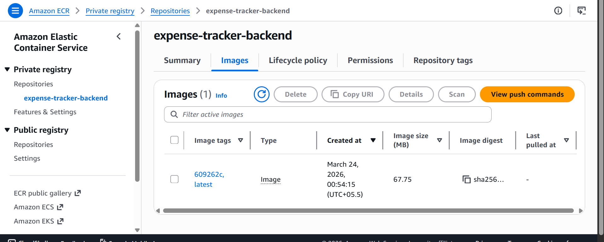
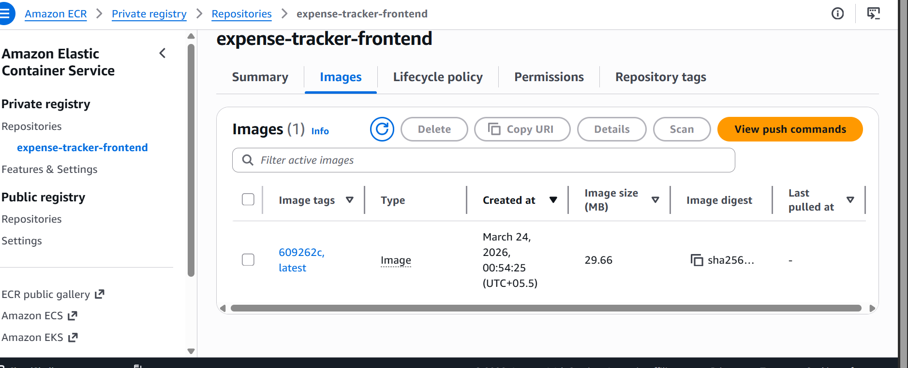
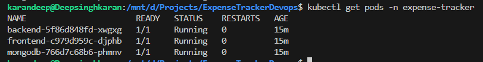
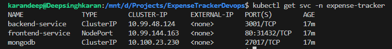

docker compose

Terraform

k8

yeh niche vale 2 delete krne hai okay

yha pe explain krna ki maine abhi sb manually deploy kra hai for testing everything is wrokig fine or

yha pe ab batana hai ki haa locally sb chl pdha hai ab bari hai ki mei cd part bhi automate kru with help of argocd

