# End-to-End DevOps Implementation for Expense Tracker (CI/CD, Docker, Kubernetes,Monitoring)

---

###### *Project Overview*

This project is a DevOps-based deployment of an Expense Tracker application built with a React frontend, Node.js/Express backend, and MongoDB database. The goal of this project is to implement a complete DevOps workflow covering source control, CI/CD, containerization, security scanning, container registry management, Kubernetes deployment, and monitoring.

The application is designed using a microservices-style approach, where the frontend, backend, and database run in separate containers and Kubernetes pods. The workflow includes GitHub for source code management, Jenkins and GitHub Actions for automation, Docker for containerization, Trivy for vulnerability scanning, Amazon ECR for image storage, Minikube for local Kubernetes deployment, and Prometheus with Grafana for monitoring and observability.

This project was built to strengthen practical DevOps skills and make the application deployment process more automated, scalable, secure, and production-oriented.

---

***Objective***

The objective of this project is to transform a full-stack Expense Tracker application into a complete DevOps project by implementing CI/CD, containerization, vulnerability scanning, image management through Amazon ECR, Kubernetes-based deployment, and monitoring with Prometheus and Grafana.

---

###### *Architecture*

The project uses a microservices-style architecture where the React frontend, Node.js/Express backend, and MongoDB database run as separate containers and Kubernetes pods. Source code is stored in GitHub, GitHub Actions automates build and security scan stages. Docker images are scanned with Trivy and pushed to Amazon ECR. The application is deployed locally on Minikube, and Prometheus with Grafana is used for monitoring and visualization. Terraform can be added to provision infrastructure such as ECR repositories.

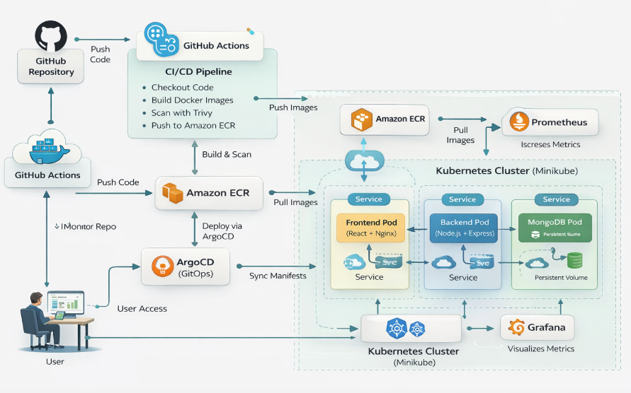

---

###### *Tech Stack*

React, Node.js, Express, MongoDB, GitHub, Jenkins, GitHub Actions, Docker, Trivy, Amazon ECR, Kubernetes (Minikube), Prometheus, Grafana, and Terraform.

---

###### *Backend Containerization*

Docker is used to containerize the backend service to ensure consistency across different environments.

A Dockerfile is created for the backend application using a  **multi-stage build approach** , which helps reduce the final image size by separating the build and runtime environments. This improves efficiency and keeps the production image lightweight.

Additionally, a **non-root user is created and used inside the container** as a security best practice. This prevents the application from running with root privileges and reduces potential security risks.

After creating the Dockerfile, the image is built locally using Docker to verify that the backend service runs correctly inside a containerized environment.

The image below shows the successful build of the backend Docker image.

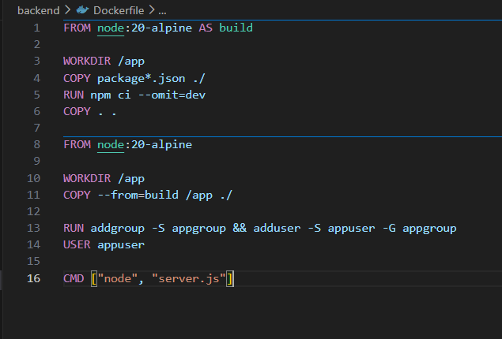

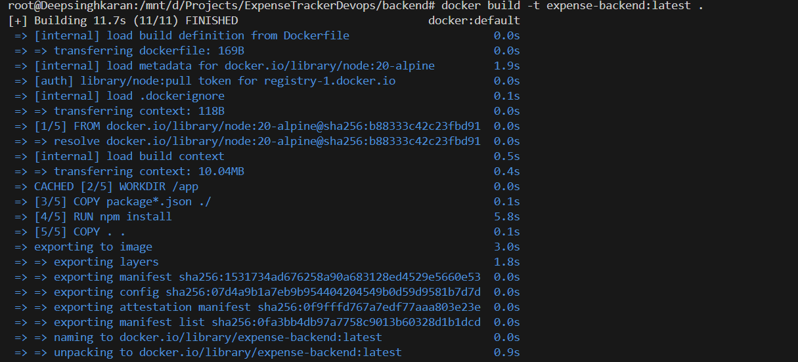

---

###### *Frontend Containerization*

The frontend is containerized using a multi-stage Docker build where Node.js is used to build the React app, and Nginx is used to serve the static files. Nginx is chosen for its high performance, efficient static content delivery, and production readiness.

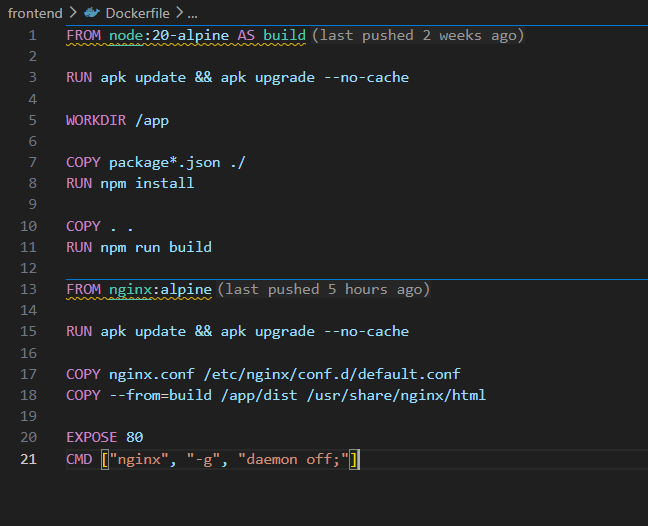

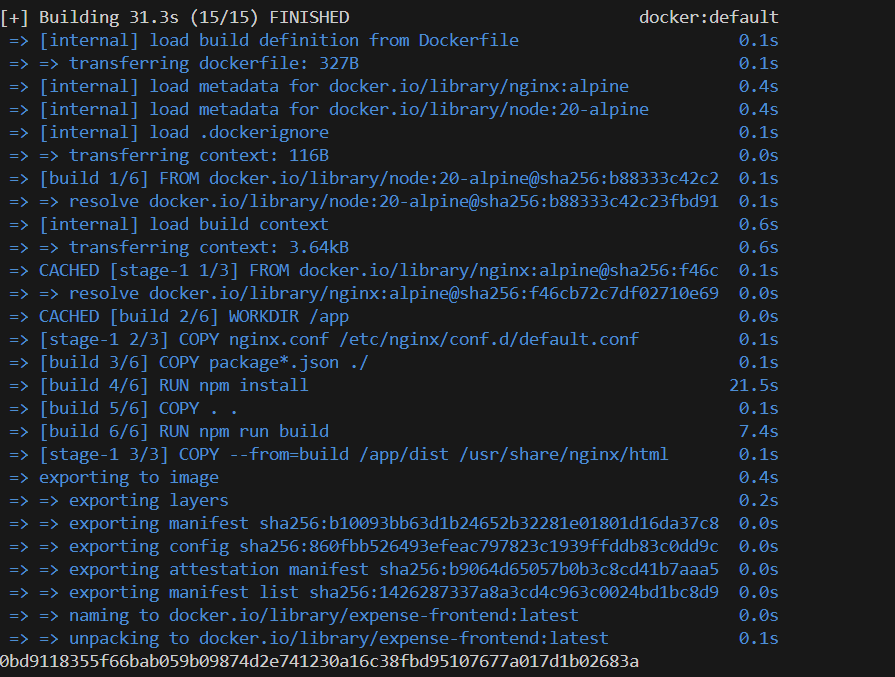

After building the Docker images, the containers are started locally. The `docker ps` command is used to verify that both the frontend and backend containers are running successfully.

This step confirms that the services are properly containerized and functioning as expected in a local environment.

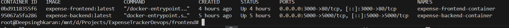

---

###### *Docker Compose*

Before using Docker Compose, the frontend and backend containers had to be started individually, which is not efficient from a DevOps perspective. To simplify the workflow, a `docker-compose.yml` file is created to run both services together with a single command.

This improves developer productivity, reduces manual effort, and makes the local setup more consistent and easier to manage.

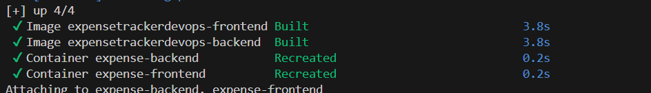

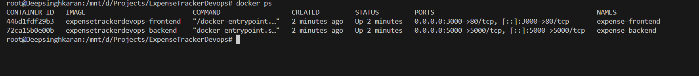

---

###### *Jenkins Pipeline*

As Jenkins is widely used in industry-standard CI/CD workflows, it was initially selected for this project. A Jenkins pipeline was created to automate the core CI tasks, including source code checkout from SCM, building Docker images for both the frontend and backend services, and scanning both images using Trivy for vulnerability detection.

**Why I choose Github Actions > jenkins ?**

During implementation, the main challenge was pipeline automation. To trigger Jenkins automatically, two common approaches were considered: **polling** and  **webhooks** . Polling requires Jenkins to check the repository at regular time intervals, which is not the most efficient approach. The better practice is to use  **webhooks** , where GitHub notifies Jenkins immediately after a code push. However, webhook setup was more difficult to implement in the local environment.

Because of this challenge, Jenkins was used mainly to understand and practice the CI pipeline flow, while full automation was later handled more effectively through GitHub Actions.

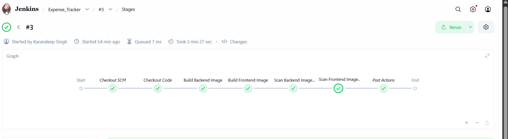

---

###### *GitHub Actions Workflow > Jenkins*

GitHub Actions was used to automate the CI/CD pipeline on every push to the `main` branch. The workflow checks out the code, configures AWS credentials, builds Docker images for both the frontend and backend services, and scans them using Trivy for vulnerability detection.

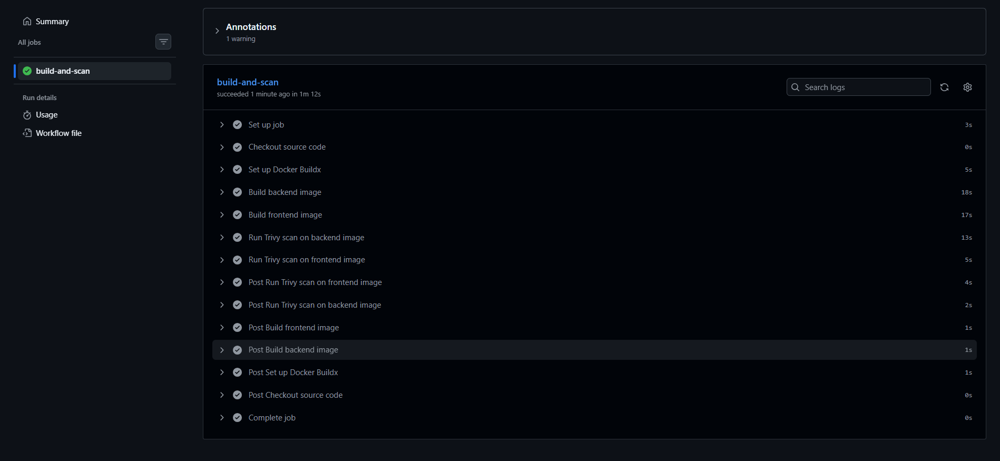

###### *Infrastructure Provisioning with Terraform*

Terraform is used to create the Amazon ECR repositories for the project. An ECR lifecycle policy is also added to manage image retention automatically, making the infrastructure setup more automated and production-oriented.

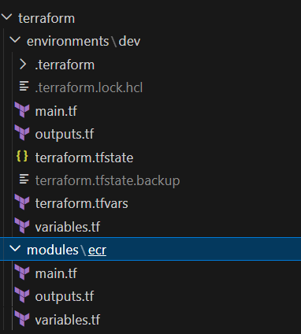

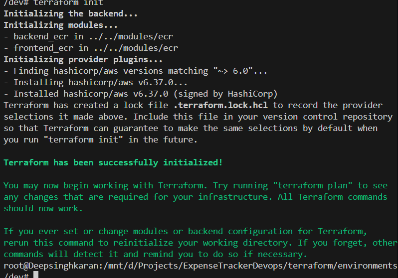

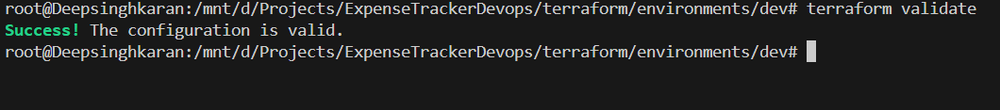

Terraform plan is used to preview infrastructure changes before applying them.

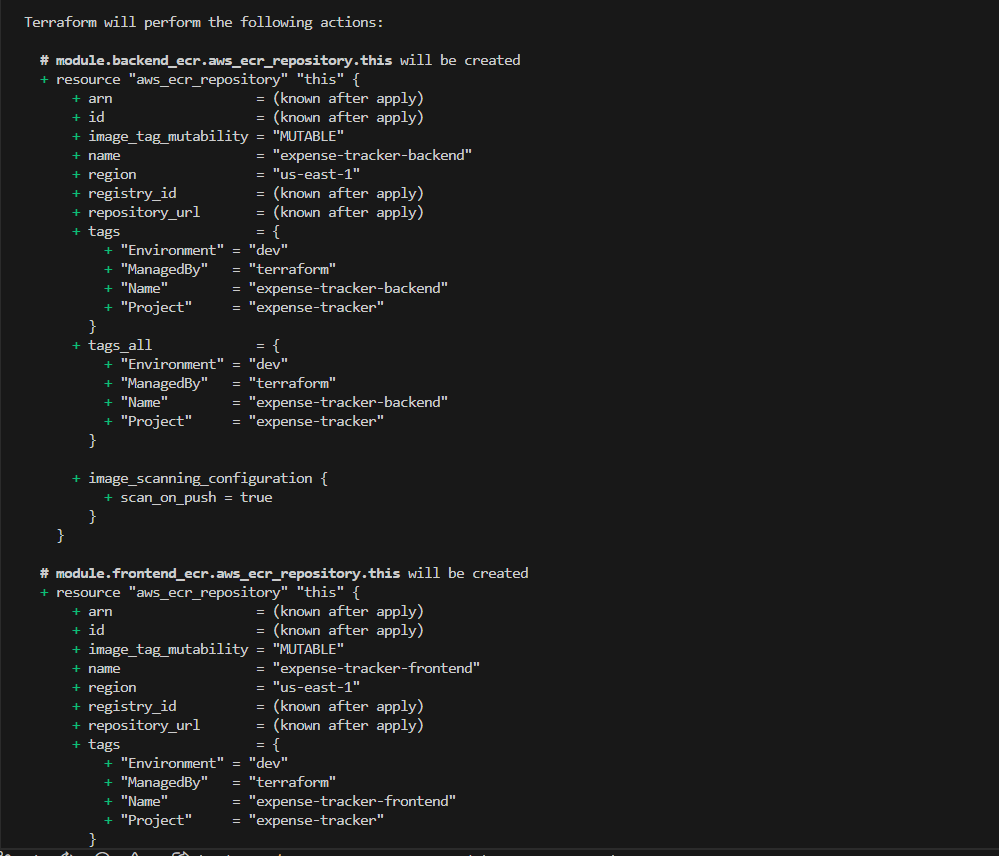

After I go through the plan , I use terraform apply to create the infra

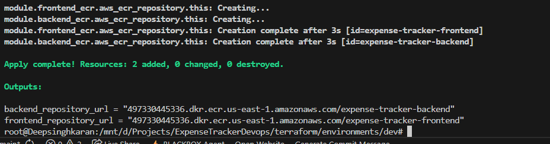

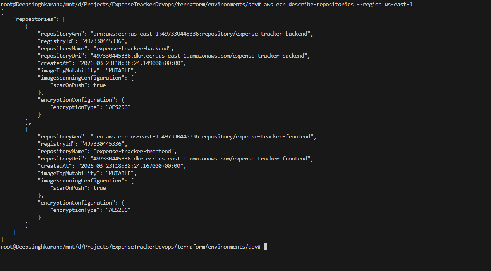

###### *Updating the GitHub Actions Workflow*

The GitHub Actions workflow was further updated to include pushing Docker images to Amazon ECR and automatically updating the Kubernetes manifest files with the latest image tags.

After building and scanning the frontend and backend images, the workflow tags them and pushes them to their respective ECR repositories. Once the images are pushed, the Kubernetes deployment manifests are updated so that they reference the newly generated image versions.

This enhancement makes the CI/CD pipeline more complete and reduces manual deployment effort by keeping the container registry and Kubernetes configuration synchronized with the latest application build.

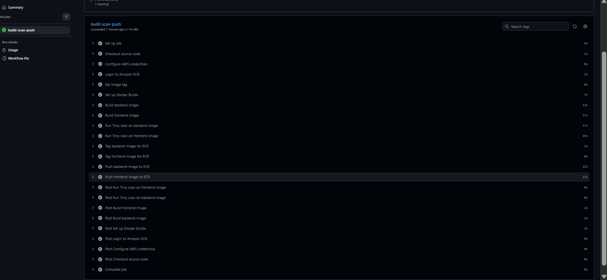

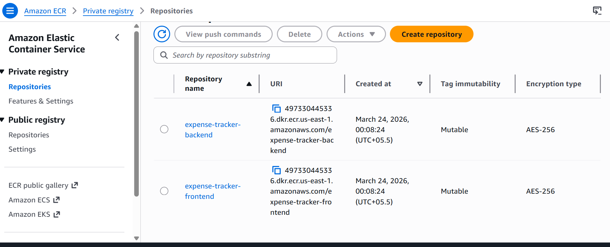

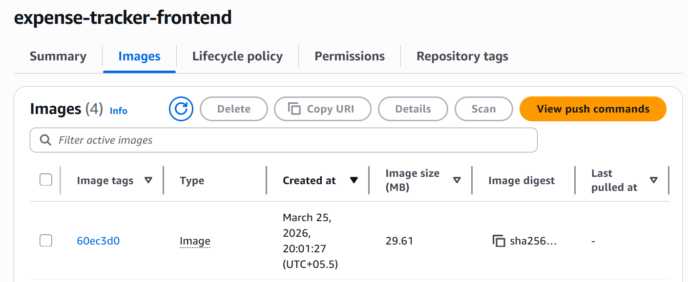

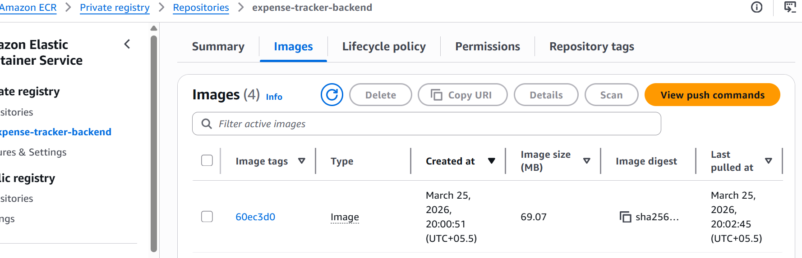

GitHub Secrets are used to securely store sensitive information like AWS credentials instead of hardcoding them in the workflow, ensuring better security and best practices.

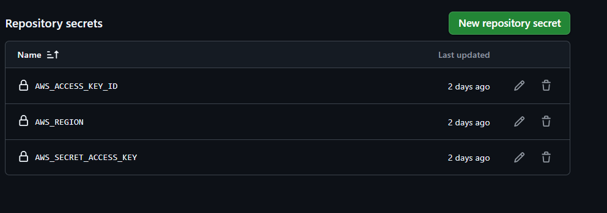

###### *Kubernetes Deployment with Minikube(local)*

Folder Structure

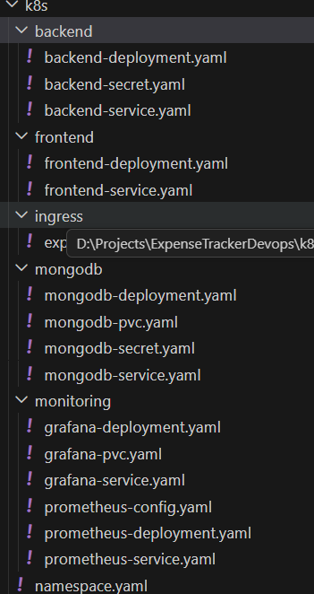

The application is first deployed on a  **local Kubernetes cluster using Minikube** . This allows testing and validation of the complete system in a cost-effective and controlled environment.

All components including frontend, backend, MongoDB, and monitoring tools (Prometheus and Grafana) which are add later  are deployed as separate pods and services within the cluster. Ingress is used to expose the application externally.

Although the application can also be deployed on **Amazon EKS (Elastic Kubernetes Service)** for a production-like environment, it may incur costs under AWS usage. Therefore, Minikube is used initially to build, test, and validate the deployment locally before considering a cloud deployment.

This approach ensures that the system works correctly end-to-end without incurring unnecessary cloud expenses during development.

The screenshots confirm that all application pods are running successfully and the application is working correctly in the Kubernetes cluster.

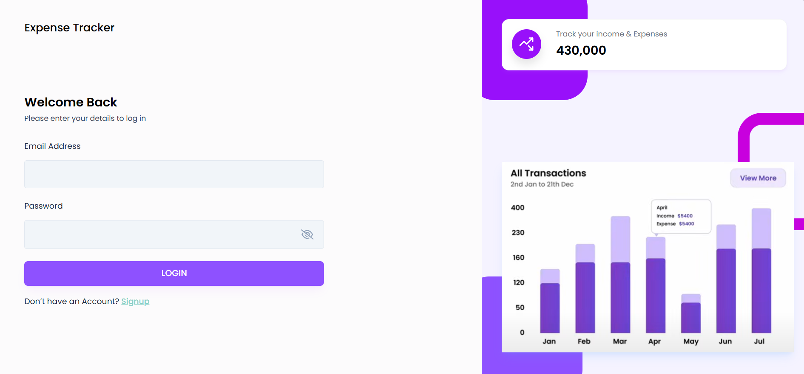

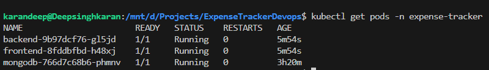

###### *ArgoCD (GitOps Deployment)*

To make the deployment process more automated and aligned with modern DevOps practices, **ArgoCD** is introduced as a GitOps tool.

ArgoCD continuously monitors the Kubernetes manifest files stored in the GitHub repository. Whenever there is a change in the repository (such as updated image tags from the CI/CD pipeline), ArgoCD automatically detects the change and syncs it with the Kubernetes cluster.

In this project, after the GitHub Actions workflow updates the Kubernetes manifests with the latest image tags, ArgoCD automatically pulls those changes and deploys the updated application to the cluster.

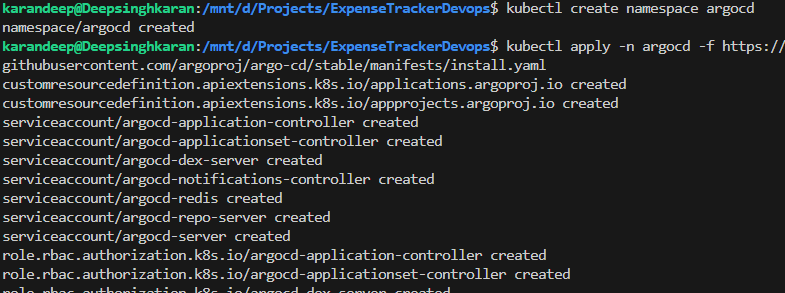

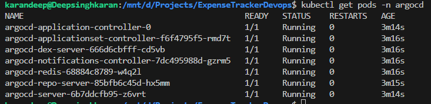

###### *ArgoCD Setup and Configuration*

ArgoCD is configured to manage the deployment of the application using a GitOps approach. The Kubernetes manifests stored in the GitHub repository are connected to ArgoCD as the source of truth.

An **automatic sync policy** is enabled to ensure that any changes in the repository are automatically applied to the Kubernetes cluster without manual intervention.

Additionally, the following options are configured:

* **Auto Sync** : Automatically applies changes from the repository to the cluster
* **Prune Resources** : Removes resources from the cluster that are no longer defined in the repository
* **Self Heal** : Automatically corrects any drift between the desired state (Git) and the actual state (cluster)

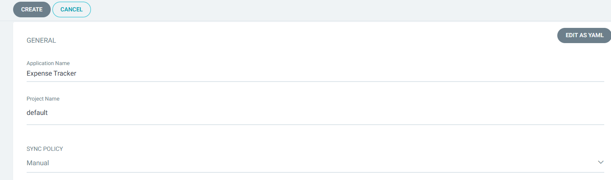

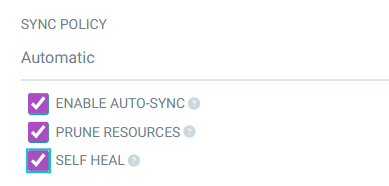

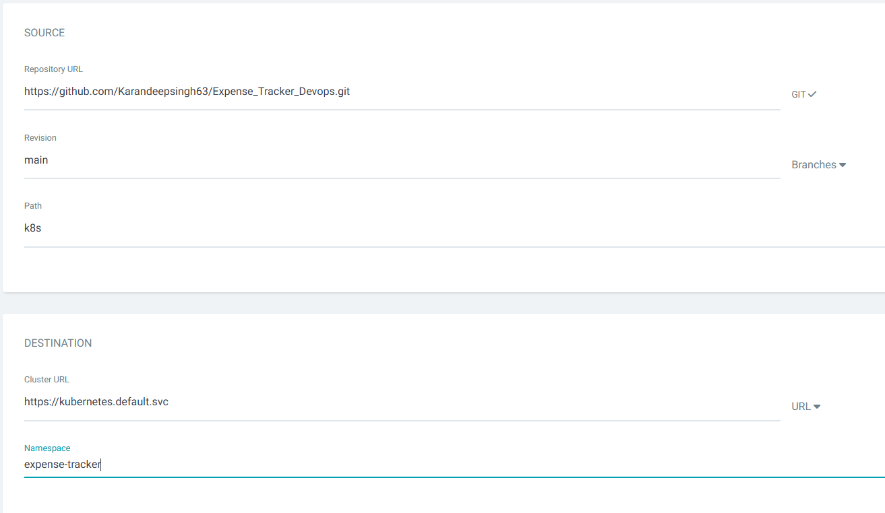

###### *ArgoCD Deployment Visualization*

The screenshot shows the ArgoCD dashboard where the **expense-tracker application** is healthy and successfully synced, meaning the Kubernetes cluster matches the Git repository state.

The application is divided into three main components:

* Frontend
* Backend
* MongoDB

Each is deployed as a Kubernetes Deployment managing its ReplicaSets and Pods. The green indicators confirm that all pods are running successfully.

Additional resources include:

* PVC for MongoDB (data persistence)
* Secrets (secure credentials)
* Services (inter-service communication)

The diagram also shows the relationship between Deployments, ReplicaSets, and Pods.

Overall, it confirms that the application is deployed correctly, running smoothly, and continuously managed by ArgoCD

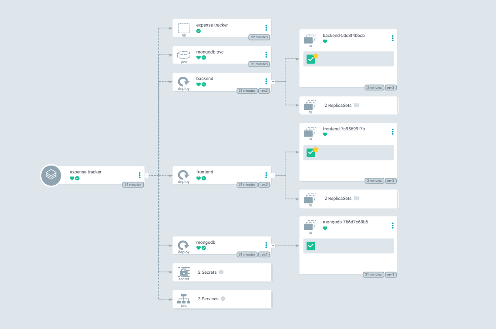

###### *Monitoring with Prometheus and Grafana*

In the final stage, Prometheus and Grafana were added to implement monitoring and observability for the project.

To expose application metrics, a dedicated metrics endpoint was added in the `server.js` file. Prometheus was then deployed in the Kubernetes cluster under the **monitoring** namespace and configured to scrape metrics from the application.

Grafana was also deployed in the same namespace and connected to Prometheus as the data source. After integration, dashboards were created to visualize application metrics and monitor the overall system behavior.

This setup makes it easier to observe application performance, track metrics, and improve operational visibility

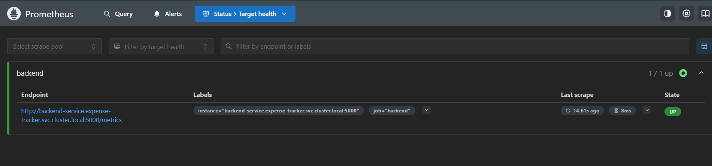

GRAFANA: for visualization

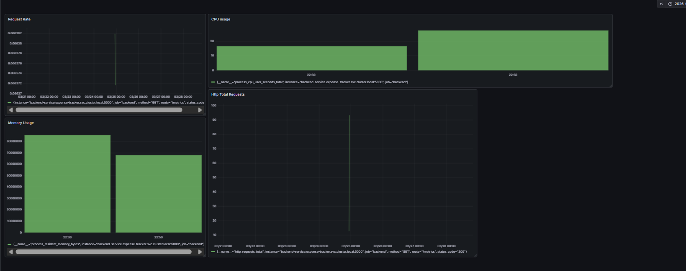

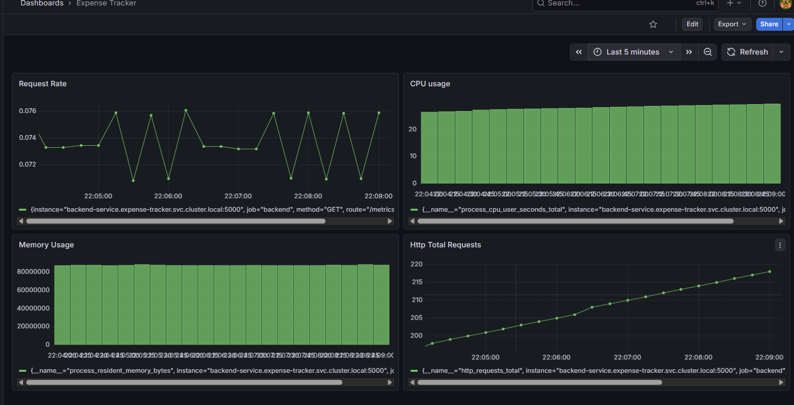

###### *ArgoCD Service-to-Pod Visualization*

The screenshot shows the ArgoCD dashboard view of how **services are connected to their respective pods** in the Kubernetes cluster.

Each service is mapped to a running pod:

* **backend-service → backend pod**
* **frontend-service → frontend pod**
* **mongodb service → mongodb pod**
* **grafana-service → grafana pod**
* **prometheus-service → prometheus pod**

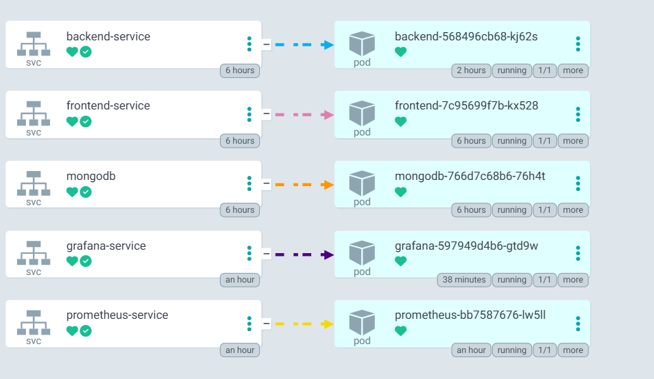

###### *Challenges Faced*

**Jenkins Webhook Setup**:   Configuring webhook-based triggers in a local environment was difficult due to networking and accessibility limitations. As a result, initial automation relied on polling, and later GitHub Actions was adopted for a more reliable and scalable CI/CD approach.

**Trivy Vulnerability Handling**:  Initial scans reported multiple vulnerabilities in Docker images. I ensured that development dependencies like nodemon were excluded from production builds. Some remaining issues were due to third-party libraries (e.g., excel.js), which were treated as dependency-chain risks rather than application-level issues. These were documented while maintaining required functionality.

**Minikube Networking and Ingress**:  Setting up ingress in a local Minikube environment was challenging due to WSL and Windows networking limitations. To ensure stable access, NodePort and port-forwarding were used for testing, while ingress configuration was kept for production readiness.

**Initial Deployment with ECR and Kubernetes**: Since Minikube runs locally, the Kubernetes cluster does not automatically have access to private images stored in Amazon ECR. Therefore, for the first deployment, Docker registry secrets were manually created in the cluster, and Kubernetes manifests were applied manually. This ensured that the cluster could authenticate with ECR and successfully pull the images.

**ArgoCD Initial Configuration**: Understanding and configuring ArgoCD required learning GitOps concepts and correctly setting up repository sync, auto-sync policies, and cluster access. Initial setup issues were resolved through iterative configuration and testing.

###### *Conclusion*

This project demonstrates a complete end-to-end DevOps implementation by transforming a full-stack Expense Tracker application into a production-oriented system. It covers the entire lifecycle, including containerization, CI/CD automation, security scanning, infrastructure provisioning, Kubernetes deployment, GitOps with ArgoCD, and monitoring using Prometheus and Grafana.

The integration of tools like GitHub Actions, Docker, Amazon ECR, Kubernetes, and Terraform ensures that the application is scalable, secure, and automated. The use of ArgoCD enables continuous deployment through a GitOps approach, while Prometheus and Grafana provide real-time observability of the system.

Overall, this project reflects real-world DevOps practices and highlights the ability to design, build, and manage a complete cloud-native application pipeline
